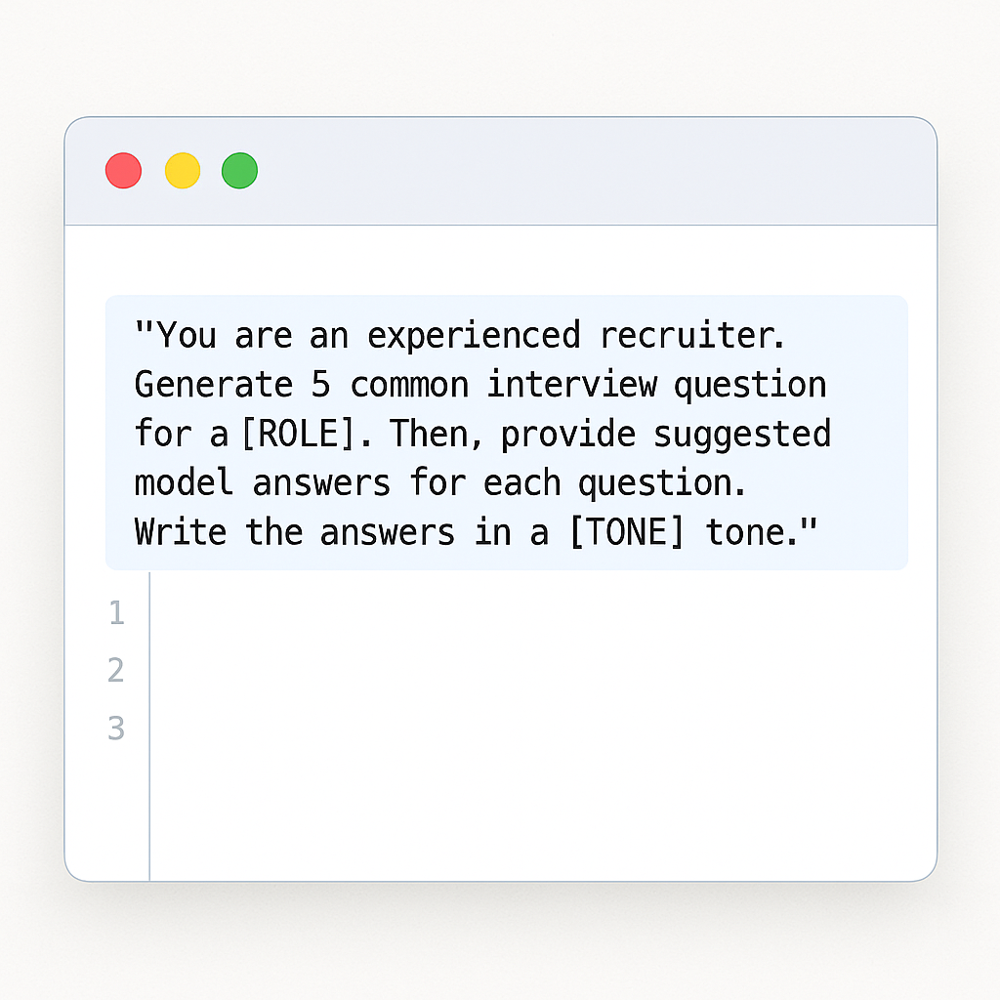
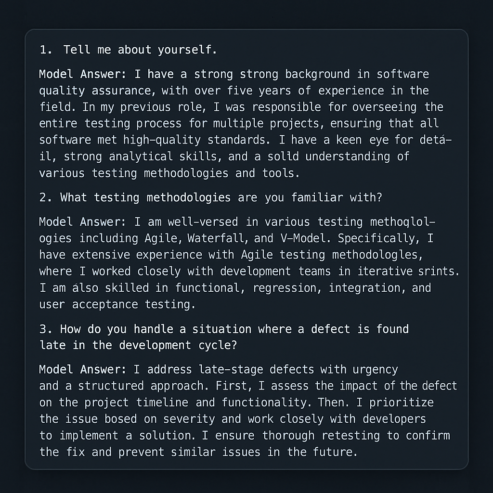

# 🚀 Smart Interview Q&A Generator

Welcome to the Smart Interview Q&A Generator — a mini-project showcasing prompt engineering skills to create realistic interview questions and answers for any role. This tool demonstrates practical prompt engineering, communication, and psychology-informed techniques.

---

## 🌟 Features

✅ Generate role-specific interview Q&A  
✅ Customize tone of answers (confident, humble, etc.)  
✅ Tailor answers with your own CV for relevance  

---

## 📂 Project Files

- [Project README](https://github.com/jbuk101/smart-interview-qa-generator/blob/main/README.md)
- [Example Q&A Outputs](https://github.com/jbuk101/smart-interview-qa-generator/blob/main/outputs/example_qas.md)

---

## 📸 Screenshots

**Example Prompt:**

**Example Q&A Output:**

---

## 📖 About

Built by [Jon James](https://linkedin.com/in/jonwjames), combining technical support expertise with prompt engineering and psychology to build human-centered AI tools.  
Check out the [GitHub repository](https://github.com/jbuk101/smart-interview-qa-generator) for source files and more examples.

